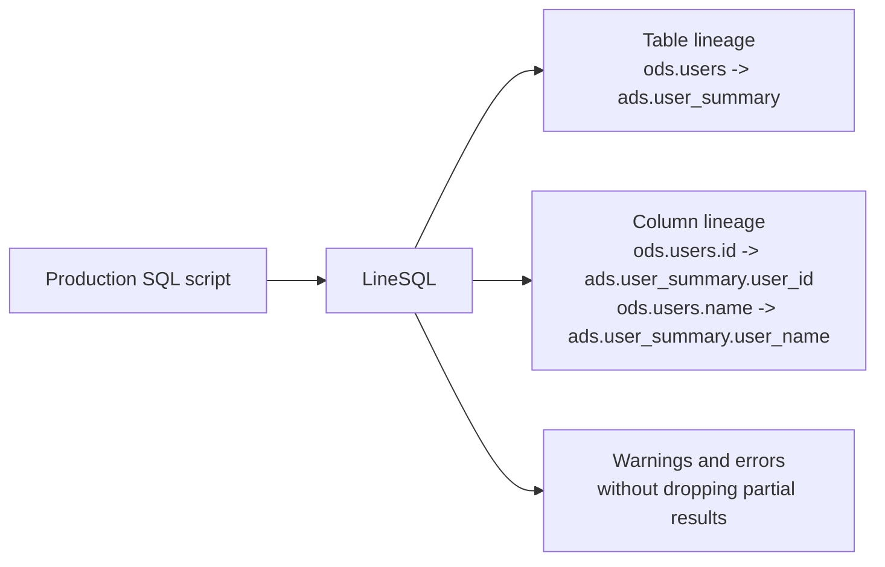

# LineSQL

Turn messy production SQL into table and column lineage.

[](https://github.com/jarredhj0214/linesql/actions/workflows/maven.yml)
[](https://central.sonatype.com/artifact/io.github.jarredhj0214/linesql-all)
[](LICENSE)
[](pom.xml)
[](pom.xml)

LineSQL is a JVM-native, ANTLR4-based SQL lineage parser for real-world data platform SQL.

It parses SQL from engines such as Spark, Hive, Flink, StarRocks, MySQL, Oracle, SQL Server, PostgreSQL, and OceanBase, then returns a unified model for table lineage, column lineage, clause-level column usage, and parser diagnostics.

LineSQL is not a SQL execution engine, optimizer, or query planner. It is built for metadata platforms, data catalogs, governance systems, quality platforms, impact analysis, and lineage services that need practical SQL understanding inside JVM applications.

If LineSQL helps your data platform work, please star the repository. Stars make it easier for more SQL cases, dialect contributors, and production feedback to find the project.

## The Shape of the Problem

```sql
CREATE TEMPORARY VIEW active_users AS
SELECT id, name, dt
FROM ods.users
WHERE status = 'ACTIVE';

INSERT OVERWRITE TABLE ads.user_summary(user_id, user_name)
SELECT id, name
FROM active_users
WHERE dt = '${bizdate}';
```

LineSQL keeps useful lineage even when SQL is a script, contains temporary views, uses scheduler variables, or mixes dialect-specific syntax.



## At a Glance

```java
import io.github.linesql.core.LineSql;
import io.github.linesql.core.model.LineageResult;

LineageResult result = LineSql.parse(
    "insert into ads.user_summary(user_id) select id from ods.users"
);

System.out.println(result.getInputTables());      // ods.users
System.out.println(result.getOutputTables());     // ads.user_summary
System.out.println(result.getColumnLineage());    // ods.users.id -> ads.user_summary.user_id
```

```xml
<dependency>
    <groupId>io.github.jarredhj0214</groupId>
    <artifactId>linesql-all</artifactId>
    <version>0.1.0-alpha.4</version>
</dependency>
```

## Why LineSQL

Modern data platforms rarely run one clean SQL dialect. Real SQL often mixes Spark, Hive, Flink, StarRocks, MySQL, Oracle, SQL Server, scheduler placeholders, temporary views, UDTFs, Chinese identifiers, long scripts, and partially broken statements.

LineSQL is designed around these constraints:

- **Automatic dialect detection**: `LineSql.parse(sql)` is the default entry point.
- **Lineage-first output**: table lineage, column lineage, and clause-level column usages are part of the public model.
- **Graceful degradation**: return table lineage and diagnostics when column lineage is partial.
- **Script-friendly parsing**: bad statements should not block the rest of a script.
- **JVM-native integration**: suitable for Java catalog, governance, metadata, quality, and impact-analysis services.

## Use Cases

LineSQL is built for systems that need SQL understanding without owning a full query planner:

| Use case | What LineSQL provides |
| --- | --- |
| Data catalog ingestion | Source tables, target tables, affected tables, and parser diagnostics |
| Column-level lineage | Projection, insert, CTAS, view, update, and merge dependencies where supported |
| Impact analysis | Downstream table and column dependencies from SQL scripts |
| Data governance | Clause-level usages for filters, grouping, ordering, and DML predicates |
| SQL inventory | Statement type, dialect, parse warnings, and unsupported SQL visibility |
| Migration assessment | Dialect detection and case-backed compatibility checks |

## What Makes It Different

LineSQL optimizes for lineage extraction rather than query execution. The parser accepts production-oriented SQL shapes, keeps dialect-specific grammar modules, and exposes one result model so downstream services do not need to normalize every engine by themselves.

The core contract is simple:

- parse one statement or a multi-statement script;
- detect the dialect automatically or accept an explicit dialect;
- return source tables, target tables, column lineage, clause column usages, warnings, and errors;
- preserve partial results when a script contains unsupported or broken SQL;
- keep every supported scenario backed by SQL case files and manifest assertions.

## Positioning

| Project type | Primary goal | Best fit | LineSQL difference |
| --- | --- | --- | --- |
| Query planner and optimizer | Validate, transform, and optimize relational plans | Engines, optimizers, federated query layers | LineSQL avoids planning and focuses on practical lineage output |
| General SQL parser | Parse SQL syntax into generic AST structures | SQL editors, simple analyzers, generic tooling | LineSQL returns a lineage model directly instead of only AST nodes |
| SQL transpiler | Convert SQL across dialects | Migration and dialect conversion | LineSQL focuses on source-to-target lineage, diagnostics, and production scripts |
| LineSQL | Extract table and column lineage from platform SQL | Catalogs, governance, quality, metadata, impact analysis | JVM-native, multi-dialect, lineage-first, case-backed |

## Current Status

LineSQL is in early alpha. The APIs and model are being shaped around production SQL cases, so incompatible changes may still happen before a stable release.

Current development version:

```text
0.1.0-alpha.4
```

Java compatibility:

- Runtime target: Java 8 bytecode
- Recommended build JDK: JDK 11
- ANTLR runtime: 4.9.3

## Support Matrix

Detailed compatibility is case-backed and tracked in [Supported Scenarios](docs/supported-scenarios.md).
Grammar-domain coverage and development priorities are tracked in [Grammar Coverage Matrix](docs/grammar-coverage-matrix.md).
Case coverage and benchmark methodology are tracked in [Benchmark and Coverage](docs/benchmark.md).

| Dialect | Status | Auto Detection | Table Lineage | Column Lineage | Clause Column Usage |
| --- | --- | --- | --- | --- | --- |
| Spark | Active parser | Yes | Broad stage-1 coverage | Broad stage-1 coverage | `WHERE`, `GROUP_BY`, `HAVING`, `ORDER_BY` |
| MySQL | Active MVP | Yes | Common SELECT, DML, DDL | Direct mappings and common expressions | Common predicate and clause usages |
| Hive | Active MVP | Yes | Common SELECT, DML, DDL | Direct mappings and common expressions | Common predicate and clause usages |
| Flink | Active MVP | Yes | Common SELECT, DML, DDL | Direct mappings and common expressions | Common predicate and clause usages |
| StarRocks | Active MVP | Yes | Common SELECT, DML, DDL | Direct mappings and common expressions | Common predicate and clause usages |
| Oracle | Active MVP | Yes | Common SELECT, DML, DDL | Direct mappings and common expressions | Common predicate and clause usages |
| SQL Server | Active MVP | Yes | Common SELECT, DML, DDL | Direct mappings and common expressions | Common predicate and clause usages |
| PostgreSQL | Baseline MVP | Yes | SELECT, DML, CTAS, VIEW, `ON CONFLICT`, `RETURNING`, `MERGE` | Direct mappings and common expressions | Basic predicate and merge/clause usages |
| OceanBase | Baseline MVP | Yes | MySQL and Oracle compatibility-mode baseline | Direct mappings through compatibility modes | Basic compatibility-mode usages |

Automatic detection is anchor-based. Dialect-neutral SQL currently falls back to Spark; callers can pass an explicit dialect when the execution engine is known.

Current regression corpus:

| Metric | Current value |
| --- | ---: |
| Dialects | 9 |
| SQL cases | 834 |
| Column-lineage cases | 542 |
| Diagnostic cases | 14 |

The corpus is intentionally transparent: SQL case files and manifest expectations live under each dialect module, so contributors can inspect exactly what a release claims to support.

## Modules

| Module | Description |
| --- | --- |
| `linesql-all` | Aggregate dependency for core plus all bundled dialect parsers |
| `linesql-core` | Public model, facade API, parser SPI, statement splitter, dialect detector, diagnostics |
| `linesql-dialect-spark` | Spark SQL parser and lineage visitor |
| `linesql-dialect-mysql` | MySQL parser MVP |
| `linesql-dialect-hive` | Hive parser MVP |
| `linesql-dialect-flink` | Flink parser MVP |
| `linesql-dialect-starrocks` | StarRocks parser MVP |
| `linesql-dialect-oracle` | Oracle parser MVP |
| `linesql-dialect-sqlserver` | SQL Server parser MVP |
| `linesql-dialect-postgresql` | PostgreSQL baseline parser module |
| `linesql-dialect-oceanbase` | OceanBase compatibility-mode parser module |
| `linesql-cli` | Command-line JSON output |

## Installation

Most applications can depend on `linesql-all`. It brings in the public API and all bundled dialect parsers, and `LineSql.parse(sql)` discovers them from the classpath.

```xml
<dependency>
    <groupId>io.github.jarredhj0214</groupId>
    <artifactId>linesql-all</artifactId>
    <version>0.1.0-alpha.4</version>
</dependency>
```

For smaller deployments, use `linesql-core` plus only the dialect modules you need.

```xml
<dependency>
    <groupId>io.github.jarredhj0214</groupId>
    <artifactId>linesql-core</artifactId>
    <version>0.1.0-alpha.4</version>
</dependency>

<dependency>
    <groupId>io.github.jarredhj0214</groupId>
    <artifactId>linesql-dialect-spark</artifactId>
    <version>0.1.0-alpha.4</version>
</dependency>
```

## Quick Start

Automatic dialect detection:

```java
import io.github.linesql.core.LineSql;
import io.github.linesql.core.model.LineageResult;

LineageResult result = LineSql.parse(
    "insert overwrite table ads.user_summary select id, name from ods.users"
);
```

Explicit dialect:

```java
import io.github.linesql.core.LineSql;
import io.github.linesql.core.model.LineageResult;
import io.github.linesql.core.model.SqlDialect;

LineageResult result = LineSql.parse(
    "select id from ods.users",
    SqlDialect.SPARK
);
```

Script parsing:

```java
import io.github.linesql.core.LineSql;
import io.github.linesql.core.model.LineageResult;

import java.util.List;

List<LineageResult> results = LineSql.parseScript(
    "create temporary view v as select id from ods.users; "
        + "insert into ads.user_ids select id from v;"
);
```

Parse options:

```java
import io.github.linesql.core.LineSql;
import io.github.linesql.core.model.LineageResult;
import io.github.linesql.core.model.ParseOptions;
import io.github.linesql.core.model.SqlDialect;

import java.util.Arrays;

LineageResult result = LineSql.parse(
    "select id from ods.users",
    ParseOptions.builder()
        .dialectHints(Arrays.asList(SqlDialect.SPARK, SqlDialect.HIVE))
        .build()
);
```

## Output Model

`LineageResult` is the main public output.

| Field | Meaning |
| --- | --- |
| `version` | Output model version |
| `dialect` | Selected SQL dialect |
| `dialectConfidence` | Auto-detection confidence |
| `dialectDetectionReason` | Why the dialect was selected |
| `statementType` | Statement category such as `SELECT`, `INSERT`, `CREATE_VIEW` |
| `inputTables` | Source tables |
| `outputTables` | Target or affected tables |
| `columnLineage` | Projection lineage edges from source columns to target columns |
| `columnUsages` | Clause-level column usages such as `WHERE`, `GROUP_BY`, `HAVING`, `ORDER_BY` |
| `diagnostics` | Parser warnings and errors |

Example JSON:

```json
{
  "version": "0.1",
  "dialect": "SPARK",
  "dialectConfidence": 0.92,
  "dialectDetectionReason": "Spark insert overwrite, lateral view, temporary view, or USING syntax",
  "statementType": "INSERT",
  "inputTables": [
    {
      "catalog": null,
      "schema": "ods",
      "name": "users"
    }
  ],
  "outputTables": [
    {
      "catalog": null,
      "schema": "ads",
      "name": "user_summary"
    }
  ],
  "columnLineage": [
    {
      "target": {
        "table": {
          "catalog": null,
          "schema": "ads",
          "name": "user_summary"
        },
        "name": "user_id"
      },
      "sources": [
        {
          "table": {
            "catalog": null,
            "schema": "ods",
            "name": "users"
          },
          "name": "id"
        }
      ],
      "expression": "id"
    }
  ],
  "columnUsages": [
    {
      "type": "WHERE",
      "column": {
        "table": {
          "catalog": null,
          "schema": "ods",
          "name": "users"
        },
        "name": "dt"
      }
    }
  ],
  "diagnostics": []
}
```

## CLI

Build the CLI:

```bash
./scripts/mvn-jdk11 -q -pl linesql-cli -am package
```

Run with auto detection:

```bash
java -jar linesql-cli/target/linesql-cli-0.1.0-alpha.4.jar \
  "insert overwrite table ads.user_summary select id from ods.users"
```

Run with explicit dialect:

```bash
java -jar linesql-cli/target/linesql-cli-0.1.0-alpha.4.jar \
  --dialect HIVE \
  "select id from ods.users"
```

## Build From Source

```bash
git clone https://github.com/jarredhj0214/linesql.git
cd linesql
./scripts/mvn-jdk11 clean test
```

The helper script uses the locally configured JDK 11 for compilation while producing Java 8 compatible bytecode.

## SQL Case Corpus

SQL cases are first-class test assets. Every parser capability should be backed by SQL files and manifest expectations.

Current case layout:

```text
linesql-dialect-*/src/test/resources/sql/<dialect>/manifest.json
linesql-dialect-*/src/test/resources/sql/<dialect>/cases/*.sql
```

When adding a scenario, update both the manifest and [Supported Scenarios](docs/supported-scenarios.md).

## Contributing

Real SQL cases are the most valuable contributions right now. The best issue includes:

- dialect and engine version;
- SQL text, with sensitive names anonymized;
- expected source tables and target tables;
- expected column lineage when known;
- whether partial results are acceptable.

See [Contributing](CONTRIBUTING.md) for the development workflow.

## Known Boundaries

- LineSQL does not execute SQL.
- LineSQL does not expand `select *` without schema metadata.
- Column lineage can be partial for complex expressions, nested subqueries, procedural SQL, and dynamic SQL.
- Dialect detection is conservative and anchor-based; explicit dialect is recommended when the engine is known.
- The alpha API may change before a stable release.

## Design Docs

- [Architecture Vision](docs/design/architecture.md)
- [Benchmark and Coverage](docs/benchmark.md)
- [Supported Scenarios](docs/supported-scenarios.md)
- [Spark Stage 1](docs/design/spark-stage-1.md)
- [Development](docs/development.md)
- [Launch and Community Notes](docs/community/launch.md)
- [License Policy](docs/legal/license-policy.md)
- [Third-party Notices](THIRD_PARTY_NOTICES.md)

## Roadmap

- **Stage 1**: production-oriented lineage parser foundation for Spark, Hive, StarRocks, Flink, MySQL, Oracle, and SQL Server.
- **Stage 2**: deeper column lineage, clause-level column usages across dialects, UDTF, temp views, and CTE propagation.
- **Stage 3**: anonymized production SQL corpus, compatibility matrix, CLI improvements, syntax diagnostics, and editor-facing metadata.

## License

LineSQL is released under the Apache License 2.0. Third-party grammar and dependency provenance is tracked in [Third-party Notices](THIRD_PARTY_NOTICES.md) and [License Policy](docs/legal/license-policy.md).
